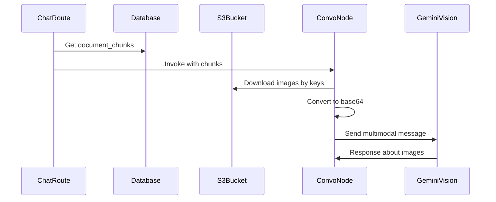

# Multimodal Image Support for PDF Context

## Overview

Enable the LLM to see images from uploaded PDFs by:

1. Downloading images from S3
2. Converting to base64
3. Including in the LLM message as multimodal content
4. Organizing by page so users can ask "describe the image on page 1"

## Architecture



## Implementation Steps

### 1. Add Image Download Helper to S3Operations

Add a method in [src/utils/s3_operations.py](src/utils/s3_operations.py) to download images by S3 key:

```python
async def download_by_key(self, s3_key: str) -> bytes:
    """Download a file directly by its S3 key."""
```

This differs from `download_file()` which builds the key from user/thread/filename.

### 2. Create Image Fetching Utility

Create a new helper in [src/utils/image_utils.py](src/utils/image_utils.py):

```python
import base64
from typing import Optional

async def fetch_images_as_base64(
    image_keys: list[str],
    s3_ops: S3Operations,
    max_images: int = 10  # Limit to avoid token overflow
) -> list[dict]:
    """
    Fetch images from S3 and convert to base64.
    
    Returns list of:
    {
        "key": "s3_key",
        "base64": "data:image/png;base64,...",
        "mime_type": "image/png"
    }
    """
```

### 3. Update ConvoNode for Multimodal Messages

Modify [src/nodes/ConvoNode.py](src/nodes/ConvoNode.py):

**Key changes:**

- Import `HumanMessage` with content parts support
- Create a separate LLM instance WITHOUT structured output for multimodal (structured output may not work with images)
- Build multimodal system message with images organized by page

**Message structure for Gemini:**

```python
# For multimodal content, use content list format
system_message = {
    "role": "system",
    "content": [
        {"type": "text", "text": "You are a helpful assistant..."},
        {"type": "text", "text": "[Page 1] Document text..."},
        {"type": "image_url", "image_url": {"url": "data:image/png;base64,..."}}
    ]
}
```

### 4. Organize Images by Page

Structure the context so each page shows:

- Page number header
- Text content
- Images for that page (as base64)

Example format:

```
[Page 1]
Text content from page 1...
[Image 1 of 2 on this page]
[base64 image data]

[Page 2]
Text content from page 2...
```

### 5. Add Image Limit Configuration

To prevent token overflow:

- Default max 10 images total per request
- First N images per page (configurable)
- Skip images if total would exceed limit

## Files to Modify

- **Create**: `src/utils/image_utils.py` - Image fetching and base64 conversion
- **Modify**: `src/utils/s3_operations.py` - Add `download_by_key()` method
- **Modify**: `src/nodes/ConvoNode.py` - Build multimodal messages with images
- **Modify**: `src/api/routes/chat.py` - Pass S3 credentials/config to state if needed

## Considerations

**Token Limits:**

- Each image adds significant tokens (Gemini: ~258 tokens per image)
- With 10 images = ~2,580 extra tokens
- May need to reduce max based on your model's context window

**Performance:**

- Downloading multiple images adds latency
- Consider parallel downloads with `asyncio.gather()`
- Could cache base64 in database for repeated queries (future optimization)

**LLM Compatibility:**

- Gemini Vision supports inline base64 images
- The `init_chat_model` with GOOGLE_MODEL should work if using `gemini-1.5-flash` or `gemini-1.5-pro`