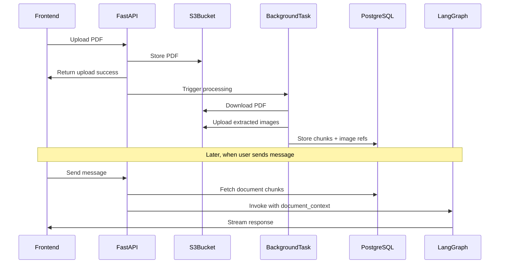

# PDF Processing and Context Integration

## Architecture Overview



## Database Schema

Add new table `document_chunks` in [src/api/database.py](src/api/database.py):

```sql
CREATE TABLE IF NOT EXISTS document_chunks (
    id SERIAL PRIMARY KEY,
    thread_id TEXT NOT NULL,
    user_id TEXT NOT NULL,
    filename TEXT NOT NULL,
    page_num INTEGER NOT NULL,
    chunk_index INTEGER NOT NULL,
    content TEXT NOT NULL,
    image_keys TEXT[],  -- S3 keys for images on this page
    created_at TIMESTAMPTZ DEFAULT NOW(),
    UNIQUE(thread_id, filename, page_num, chunk_index)
);
CREATE INDEX IF NOT EXISTS idx_doc_chunks_thread ON document_chunks(thread_id);
```

## Implementation Steps

### 1. Create PDF Processor Service

New file: `src/utils/pdf_processor.py`

- Refactor [sample_pdf_read.py](sample_pdf_read.py) into a reusable class
- Use `pymupdf` for extraction (already working in your sample)
- Add text chunking with `langchain.text_splitter.RecursiveCharacterTextSplitter` (chunk_size=1000, overlap=200)
- Return structured data: `List[{page_num, chunks: List[str], image_keys: List[str]}]`

Key function signature:

```python
async def process_pdf(
    pdf_bytes: bytes,
    user_id: str,
    thread_id: str,
    filename: str,
    s3_ops: S3Operations
) -> List[DocumentChunk]
```

### 2. Add Background Processing to Upload Route

Modify [src/api/routes/files.py](src/api/routes/files.py):

- Import `BackgroundTasks` from FastAPI
- After successful upload, trigger `process_uploaded_file()` as a background task
- Background task downloads PDF from S3, processes it, stores chunks in DB
```python
@router.post("/upload", response_model=MultiUploadResponse)
async def upload_files(
    background_tasks: BackgroundTasks,
    files: list[UploadFile] = File(...),
    ...
):
    # ... existing upload logic ...
    
    # Trigger background processing for each PDF
    for result in results:
        if result.get("content_type") == "application/pdf":
            background_tasks.add_task(
                process_uploaded_file,
                result["key"], user_id, thread_id, result["filename"]
            )
```


### 3. Add Database Functions for Document Chunks

Add to [src/api/database.py](src/api/database.py):

- `save_document_chunks(thread_id, user_id, filename, chunks)` - batch insert
- `get_document_chunks(thread_id)` - retrieve all chunks for a thread
- `delete_document_chunks(thread_id, filename)` - cleanup on file delete
- `get_processing_status(thread_id, filename)` - check if file is processed

### 4. Update Graph State

Modify [src/state/state.py](src/state/state.py):

```python
class MainGraphState(TypedDict):
    messages: Annotated[List[AnyMessage], add_messages]
    conversation_history: Annotated[List[str], add_to_conversation]
    document_context: Optional[List[dict]]  # New: injected document chunks
    Approval: Optional[bool]
```

### 5. Update ConvoNode to Use Document Context

Modify [src/nodes/ConvoNode.py](src/nodes/ConvoNode.py):

- Build document context string from `state["document_context"]`
- Include in system prompt or as a separate context message
- For images, generate presigned URLs to pass to multimodal LLM
```python
# Build context from documents
doc_context = ""
if state.get("document_context"):
    doc_context = "\n\n---\nDocument Context:\n"
    for chunk in state["document_context"]:
        doc_context += f"[Page {chunk['page_num']}] {chunk['content']}\n"

system_prompt = SYSTEM_PROMPT + doc_context
```


### 6. Inject Document Context in Chat Route

Modify [src/api/routes/chat.py](src/api/routes/chat.py):

- Before invoking graph, fetch document chunks from DB
- Add to input state as `document_context`
```python
# Fetch document context for this thread
doc_chunks = await get_document_chunks(thread_id)

input_state = {
    "messages": [HumanMessage(content=message)],
    "document_context": doc_chunks if doc_chunks else None
}
```


### 7. Handle New File Additions

The architecture naturally supports incremental file additions:

- Each upload triggers its own background processing
- `get_document_chunks(thread_id)` returns ALL chunks for the thread
- Multiple files are automatically combined in the context

### 8. Add Processing Status Endpoint (Optional but Recommended)

New endpoint in [src/api/routes/files.py](src/api/routes/files.py):

```python
@router.get("/{user_id}/{thread_id}/{filename}/status")
async def get_file_status(user_id: str, thread_id: str, filename: str):
    """Check if file has been processed and is ready for queries."""
    # Return processing status from DB
```

## Files to Create/Modify

- **Create**: `src/utils/pdf_processor.py` - PDF processing logic
- **Modify**: `src/api/database.py` - Add document_chunks table and functions
- **Modify**: `src/api/routes/files.py` - Add background task trigger and status endpoint
- **Modify**: `src/state/state.py` - Add document_context field
- **Modify**: `src/nodes/ConvoNode.py` - Use document context in prompts
- **Modify**: `src/api/routes/chat.py` - Inject document context before graph invocation

## Dependencies to Add

```
langchain-text-splitters  # For RecursiveCharacterTextSplitter
```

Already have: `pymupdf`, `boto3`, `psycopg`